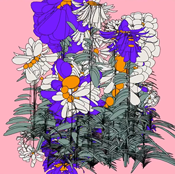
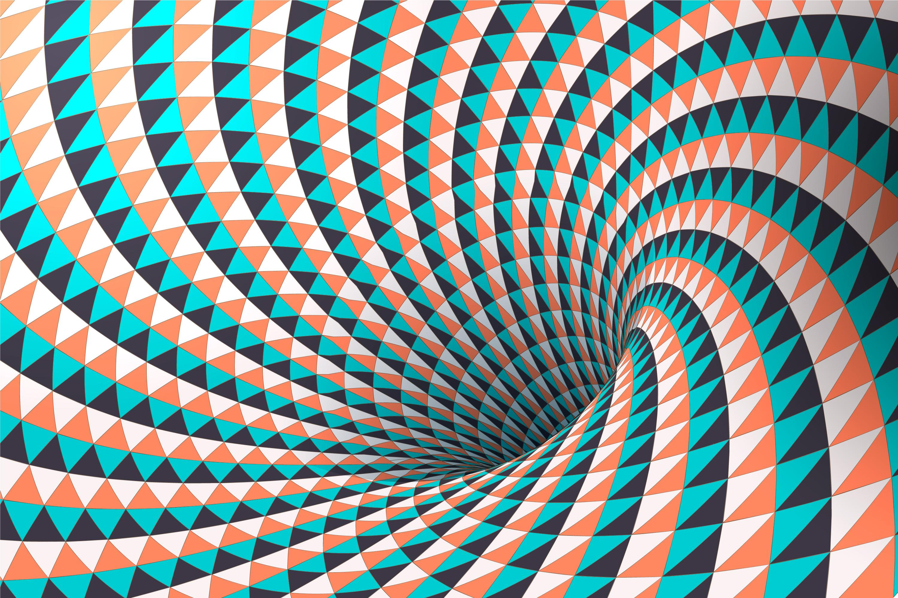
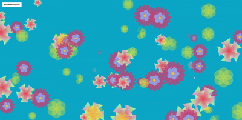
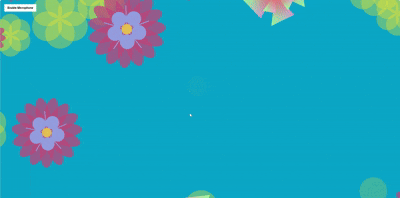
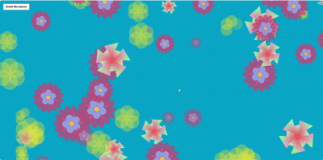

# Final Project
Xuelin Ma SID xuma0701

Yanhan Wei SID ywei0292

Weixi Qian SID wqia9153

## Part 1: Project Direction

### Project Path

Our team has chosen to create an **original piece**.

---

### Project Vision

Our project explores how a digital environment can gradually become unstable through interaction, sound, and perception, which can provide viewers with a visually stunning experience. We aim to create an interactive “digital garden” where abstract flowers continuously grow and drift across the canvas using randomness and Perlin noise, inspired by Animation もぺもぺ, William Morris floral patterns and generative p5.js artworks.

---

Animation もぺもぺ (mopemope)

---

William Morris floral patterns

---

Generative p5.js artworks

---

We are also influenced by glitch art and psychological thriller aesthetics, especially RGB splitting, chromatic aberration, and distorted digital imagery. Loud sounds from microphone input will destabilise the environment, causing the flowers and screen to tear and glitch.

---

Glitch art

---

In addition, we are inspired by optical illusion artworks and naked-eye 3D effects. Mouse movement will create layered parallax motion, making flowers at different depths move at different speeds to create the illusion of three-dimensional space.

---

Naked-eye 3D

---

Together, these mechanics create a surreal digital environment that constantly evolves and reacts to the viewer.

---

# Part 2: Mechanics

## Team Members

| Team Member | Mechanic |
|---|---|
| Xuelin Ma, xuma0701 | Perlin Noise & Randomness & Time-based |
| Yanhan Wei, ywei0292 | Audio |
| Weixi Qian, wqia9153 | User input |

---

## Perlin Noise and Randomness and Time-based Mechanic

This mechanic focuses on building the generative flower system that forms the foundation of the project. Using Perlin noise and random and Time-based values, three types of abstract flowers will continuously grow, drift, and change across the canvas instead of remaining static. Randomness will control variations such as flower size, position, and movement, making every generated composition slightly different. Perlin noise will be used to create smoother and more organic motion, allowing the flowers to move in a way that feels natural and alive rather than completely chaotic. Time-based mechanics will be used to control each flower's appearance, duration, and disappearance.

The user does not directly control this mechanic. Instead, the system behaves like a living digital environment that evolves on its own over time. This connects closely to our project vision of creating an unstable and immersive digital garden. The procedural growth of the flowers provides the calm visual foundation of the piece, which can later become distorted by audio glitches and spatial perception effects caused by user interaction.

*(Flower Generation Demonstration)*

---

## Audio Mechanic

The Audio mechanic serves as the chaotic and disruptive force within our interactive digital garden, acting as a direct contrast to the calm, organic growth generated by the Perlin noise system. Utilizing functions like `p5.AudioIn` and `mic.getLevel()`, this mechanic constantly monitors the ambient volume of the user's environment. The user interacts with this mechanic simply by making noise—speaking, clapping, or playing music. When the environment is quiet, the digital garden remains relatively peaceful. However, as the user introduces loud sounds, the volume level directly dictates the intensity of the digital distortion applied to the canvas. High volume spikes will trigger violent visual glitches, such as intense RGB colour splitting (chromatic aberration), screen tearing, and severe pixel displacement across the floral patterns. This interaction transforms the viewer into an active disruptor, perfectly connecting to our project's vision of blending tranquil generative nature with the tense, unstable aesthetics of psychological thrillers.

 
*(Note: A conceptual reference for how audio spikes will cause chromatic aberration and glitching)*

---

## User Input Mechanic

User input provides users with a channel to interact with our work, allowing them to further experience our work. Besides, user input is also one of the keys to achieving 3D parallax. Truly good 3D parallax is not about something moving, but about the user feeling that their perspective is changing, and user input can act as the steering wheel for the user to control their perspective. By translating user input into changes in perspective and then making elements at different depths move to varying degrees, we can create a sense of three-dimensional space.

3D parallax is essentially achieved by utilizing differences in movement speed. As shown in the image below, by reading the movement of the mouse, we can control the movement speed of the images before and after, creating a 3D illusion for our eyes, allowing us to perceive a 3D space that does not actually exist.

Next, let me introduce the User input interaction I designed for our project.

Firstly, users can use their mouse to push the flowers aside to freely explore our garden.

Next, users can zoom in and out using the mouse wheel. In this step, I used the 3D parallax technique I mentioned above to make the flowers at different distances move at different speeds, thus creating the illusion of moving forward in a 2D scene, just like moving through a flower bush.

Finally, I also added the function to freely move the view by holding down the left mouse button, making it easier for users to explore freely even after zooming in.

---

# Part 3: Putting It Together

All mechanics exist within the same evolving digital garden. The generative flower system creates the main visual environment, while mouse interaction introduces layered parallax movement and depth illusion, making the space feel immersive and unstable. Audio input then disrupts this environment through glitch effects such as RGB splitting and screen tearing. These mechanics continuously influence the same canvas rather than existing as separate effects. Visually, the project is connected through organic floral forms, soft movement, and digital distortion aesthetics. Together, they create a surreal interactive space that changes according to the viewer’s interaction and surrounding sound.

---

# Part 4: AI acknowledgement

Generative AI tools (ChatGPT) were used during the development of this project to assist with code generation, debugging, and technical problem-solving.

The overall project concept, visual direction, flower designs, interaction logic, parameter adjustments, testing, and final implementation decisions were developed and refined by the authors. All AI-generated code was reviewed, modified, and integrated into the final project by the team.

# Part 5: External references

Flower 1 was inspired by a Pinterest reference: https://au.pinterest.com/pin/1152358623431005277/

Flower 2 was inspired by a Pinterest reference: https://au.pinterest.com/pin/1152358623431005270/

Flower 3 was inspired by a Pinterest reference: https://au.pinterest.com/pin/1152358623431072655/

Mopemope animation:
https://www.youtube.com/watch?v=nC-bVtpIMd4
